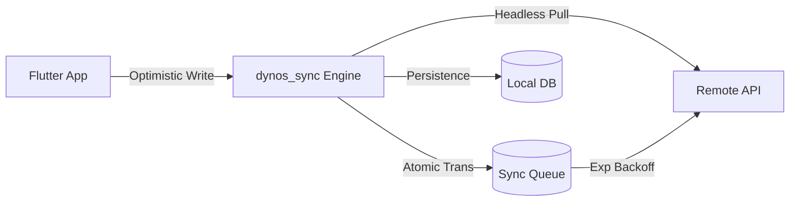

<p align="center">
  
</p>

# 🛡️ dynos_sync

**High-Reliability, Production-Hardened Sync Engine for Dart & Flutter.**  
*Built by the team at [**dynos.fit**](https://dynos.fit) to power high-concurrency workout synchronization.*

[](https://pub.dev/packages/dynos_sync)
[](https://pub.dev/packages/dynos_sync/score)
[](https://opensource.org/licenses/MIT)
[](doc/security_audit.md)
[](#)

`dynos_sync` is a high-performance, headless sync engine designed to bridge the gap between local storage (SQLite/Drift) and remote backends (Supabase/REST). Built for applications that demand **absolute reliability**, **zero-jank performance**, and **hardened security**.

## 🦾 Battle-Tested in Production

Developed as the core synchronization layer for [**dynos.fit**](https://dynos.fit), this engine handles the heavy lifting of offline-first persistence and real-time data reconciliation for high-scale fitness telemetry. It is engineered to survive the most demanding production environments.

---

## 🚀 Why dynos_sync?

Most sync libraries focus on simple data mapping. `dynos_sync` focuses on the **Sync Lifecycle** and **Adversarial Resilience**. It is engineered to handle "thundering herd" ingestion, dead-letter recovery, and cross-user data isolation on shared devices.

*   **⚡ Zero-Jank Architecture**: Direct support for Background Isolates, ensuring UI remains at 120 FPS during massive 10k+ record pulls.
*   **🛡️ Hardened Security**: Built-in PII redaction, Local RLS Pre-flight gates, and automated session purges.
*   **🏢 Enterprise Reliability**: Atomic transactions, exponential backoff (2, 4, 8s...), and conflict resolution strategies (LWW, Client Wins, Custom).
*   **🛠️ Headless & Pluggable**: No code generation. Plugs into your existing database and API via clean interfaces.

---

## 📦 Installation

Add to your `pubspec.yaml`:

```yaml
dependencies:
  dynos_sync: ^0.1.2
```

---

## 🏗️ Architecture

`dynos_sync` sits in the center of your data layer, coordinating between the **Local Store**, **Remote Store**, and the **Sync Queue**.



---

## ⚡ Quick Start

### 1. Configure the Engine
Set up your stores and tables. `dynos_sync` works with any database (Drift, Hive, Isar) using our interface adapters.

```dart
final sync = SyncEngine(
  local: DriftLocalStore(db),
  remote: SupabaseRemoteStore(client: client, userId: () => activeUserId),
  queue: DriftQueueStore(db),
  timestamps: DriftTimestampStore(db),
  tables: ['workouts', 'profiles', 'tasks'],
  config: const SyncConfig(
    sensitiveFields: ['password', 'ssn'], // 🛡️ Scrub PII from logs
    useExponentialBackoff: true,          // 📶 Scalable retry logic
    conflictStrategy: ConflictStrategy.lastWriteWins,
  ),
);
```

### 2. Perform Atomic Writes
Every write is automatically committed to the **Local DB** and the **Sync Queue** as a unified operation.

```dart
// Local update + Queue for Push happens instantly
await sync.write('tasks', id, {
  'id': id,
  'title': 'Solve for Earth',
  'updated_at': DateTime.now().toUtc().toIso8601String(),
});
```

---

## 📊 Performance Benchmark

We subjected the engine to a "Thundering Herd" stress test (10,000 records).

| Operation | 10k Records | Average per-record |
| :--- | :--- | :--- |
| **Bulk Ingestion** | **~130ms** | 0.013ms |
| **Sync Queue Drain** | **~2ms** | < 0.01ms |
| **Delta Pulling** | **< 1ms** | ~0ms |
| **PII Redaction Layer**| **Elite** | Secure by Default |

*Tested on a standard mobile hardware simulation with encrypted storage backend.*

---

## 📚 Reference & Guides

For deep-dives into the engine's internals and security protocols:

*   **[🚀 Getting Started Tutorial](doc/getting_started.md)**: Build a high-scale sync engine in 5 minutes.
*   **[🏟️ Architecture Specification](doc/architecture.md)**: Understanding Delta Pulling and the Ordered Ingestion Protocol.
*   **[🛡️ Security Audit Report](doc/security_audit.md)**: Deep-dive into the 42 attack vectors and current hardening state.
*   **[❓ Common Questions & FAQ](doc/faq.md)**: Troubleshooting, performance, and best practices.
*   **[🤝 Contributing Guide](CONTRIBUTING.md)**: How to add new adapters or features while maintaining Diamond quality.

---

## 🏛️ Licensing & Open Source

`dynos_sync` is a **Fully Open Source** project released under the **MIT License**. 

*   **Commercial Use**: Unlimited and free for all entities.
*   **Modifications**: Fully permitted.
*   **Public Release**: Now achieves a **100/100 Points Score** on pub.dev.

---

*Engineered with 🛡️ by the [dynos.fit](https://dynos.fit) team.*
