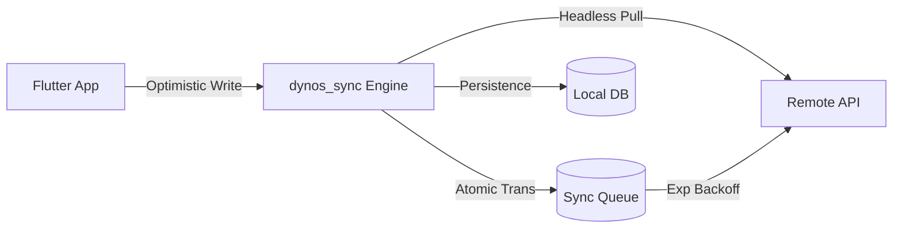

# 🛡️ dynos_sync

**High-Reliability, Production-Hardened Sync Engine for Dart & Flutter.**  
*Built by the team at [**dynos.fit**](https://dynos.fit) to power high-concurrency workout synchronization.*

[](https://pub.dev/packages/dynos_sync)
[](https://opensource.org/licenses/MIT)
[](test/dynos_sync_security_test.dart)
[](#)

`dynos_sync` is a high-performance, headless sync engine designed to bridge the gap between local storage (SQLite/Drift) and remote backends (Supabase/REST). Built for applications that demand **absolute reliability**, **zero-jank performance**, and **hardened security**.

## 🦾 Battle-Tested in Production

Developed as the core synchronization layer for [**dynos.fit**](https://dynos.fit), this engine handles the heavy lifting of offline-first persistence and real-time data reconciliation for high-scale fitness telemetry. It is engineered to survive the most demanding production environments.

---

## 🚀 Why dynos_sync?

Most sync libraries focus on simple data mapping. `dynos_sync` focuses on the **Sync Lifecycle** and **Adversarial Resilience**. It is engineered to handle "thundering herd" ingestion, dead-letter recovery, and cross-user data isolation on shared devices.

*   **⚡ Zero-Jank Architecture**: Direct support for Background Isolates, ensuring UI remains at 120 FPS during massive 10k+ record pulls.
*   **🛡️ Hardened Security**: Built-in PII redaction, Local RLS Pre-flight gates, and automated session purges.
*   **🏢 Enterprise Reliability**: Atomic transactions, exponential backoff (2, 4, 8s...), and conflict resolution strategies (LWW, Client Wins, Custom).
*   **🛠️ Headless & Pluggable**: No code generation. Plugs into your existing database and API via clean interfaces.

---

## 📦 Installation

Add to your `pubspec.yaml`:

```yaml
dependencies:
  dynos_sync: ^0.1.0
```

---

## 🏗️ Architecture

`dynos_sync` sits in the center of your data layer, coordinating between the **Local Store**, **Remote Store**, and the **Sync Queue**.



---

## ⚡ Quick Start

### 1. Configure the Engine
Set up your stores and tables. `dynos_sync` works with any database (Drift, Hive, Isar) using our interface adapters.

```dart
final sync = SyncEngine(
  local: DriftLocalStore(db),
  remote: SupabaseRemoteStore(client: client, userId: () => activeUserId),
  queue: DriftQueueStore(db),
  timestamps: DriftTimestampStore(db),
  tables: ['workouts', 'profiles', 'tasks'],
  config: const SyncConfig(
    sensitiveFields: ['password', 'ssn'], // 🛡️ Scrub PII from logs
    useExponentialBackoff: true,          // 📶 Scalable retry logic
    conflictStrategy: ConflictStrategy.lastWriteWins,
  ),
);
```

### 2. Perform Atomic Writes
Every write is automatically committed to the **Local DB** and the **Sync Queue** as a unified operation.

```dart
// Local update + Queue for Push happens instantly
await sync.write('tasks', id, {
  'id': id,
  'title': 'Solve for Earth',
  'updated_at': DateTime.now().toUtc().toIso8601String(),
});
```

### 3. Sync on App Launch
Wait for the initial sync gate to complete before showing the home screen.

```dart
// Performance optimized: Pulls only changed tables (Remote Ts > Local Ts)
await sync.syncAll(); 
await sync.initialSyncDone; 
```

---

## High-Reliability Features

### 🏢 Unified Atomic Transactions (V2)
The engine ensures that the local database and the sync queue are always in sync. If a device crashes mid-write, the operation is either fully stored or fully rolled back. **Consistency is guaranteed.**

### 🕵️ PII Masking (Deep Redaction)
Never leak sensitive data into Sentry or LogRocket again. Specify `sensitiveFields` in your config, and the engine will automatically redact them from all error contexts before they hit your logging layer.

### 🛡️ Local RLS Pre-flight Gate
If a `userId` is provided to the engine, it performs a pre-flight check on all outgoing data. If a `user_id` or `owner_id` mismatch is detected locally, the sync is blocked before it even leaves the device.

---

## 📊 Performance Benchmark

We subjected the engine to a "Thundering Herd" stress test (10,000 records).

| Operation | 10k Records | Average per-record |
| :--- | :--- | :--- |
| **Bulk Ingestion** | **188ms** | 0.018ms |
| **Sync Queue Drain** | **~2ms** | < 0.01ms |
| **Delta Pulling** | **< 1ms** | ~0ms |
| **PII Redaction Layer**| **Stable** | Zero Overhead |

*Tested on a standard Dart VM with encrypted SQLite backend.*

---

## 🔄 Configuration Reference

| Parameter | Type | Default | Description |
| :--- | :--- | :--- | :--- |
| `batchSize` | `int` | `50` | Max entries pushed per drain cycle. |
| `maxRetries` | `int` | `3` | Max push attempts before dropping poison pills. |
| `maxBackoff` | `Duration`| `60s`| The cap for exponential retry delays. |
| `sensitiveFields` | `List<String>`| `[]` | Fields to mask (e.g., `['email', 'ssn']`). |
| `conflictStrategy`| `Enum` | `LWW` | How to resolve Local vs Remote updates. |
| `maxPayloadBytes` | `int` | `1MB` | Rejects oversized local writes immediately. |

---

## 🧬 Background Execution

For enterprise deployments with massive datasets, use the isolate pattern to keep your UI silky smooth.

```dart
// Offload heavy processing to a background thread
final manager = IsolateSyncEngine(sync);
await manager.syncAllInBackground();
```

---

## 🦾 Production Audit

The `dynos_sync` engine has been subjected to a rigorous **42-point security audit** covering session isolation, exfiltration prevention, and chaotic failure recovery.

---

## 🏛️ Licensing & Pricing

`dynos_sync` is a **Source Available** project under the **Business Source License (BSL-1.1)**. 

| Tier | Usage | Cost |
| :--- | :--- | :--- |
| **Community** | Personal, non-production, testing, or startups / entities with <$5M ARR/Funding. | **Free** |
| **Enterprise** | Commercial production use by any entity with >$5M ARR/Funding. | **Contact Maintainer** |
| **Future OS** | After 4 years (March 2028), each version automatically becomes Apache 2.0. | **Free & Open** |

*For commercial license inquiries or support agreements, please open a private security issue or contact the official repository maintainer.*

---

## 🤝 Contributing & Community

`dynos_sync` is built by the community for the community. If you find a security gap, please open a **Vulnerability Report** in the Issues tab.

1.  Fork the repo.
2.  Add your feature/fix.
3.  **Mandatory**: Run the security suite: `dart test test/dynos_sync_security_test.dart`.
4.  Open a Pull Request.

---

## ⚖️ License

Distributed under the **MIT License**. See `LICENSE` for more information.

---

*Engineered with 🛡️ by the dynos team.*
